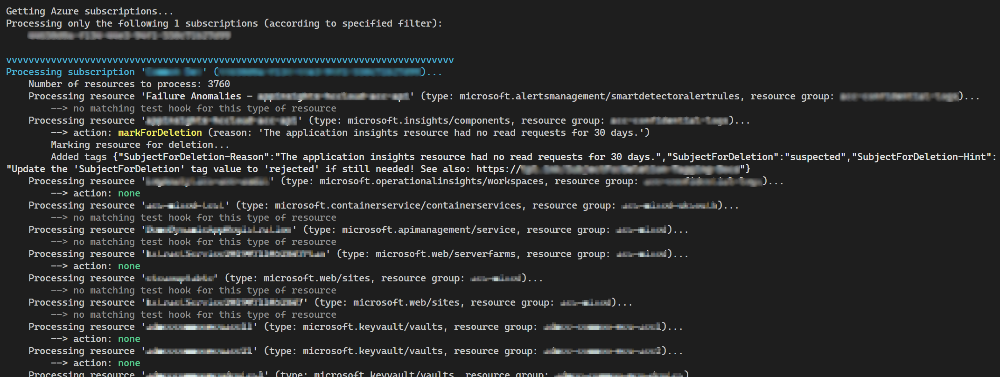

# AzSaveMoney

Clean-up unused resources and save money in your Azure environment.

The script [`MarkAndDeleteUnusedResources.ps1`](MarkAndDeleteUnusedResources.ps1) checks each Azure resource (group) across all subscriptions and eventually tags it as subject for deletion or (in some cases) deletes it automatically (after confirmation, configurable). Based on the tag's value suspect resources can be confirmed or rejected as subject for deletion and will be considered accordingly in subsequent runs.

Example usage:
```powershell
Get-Help .\MarkAndDeleteUnusedResources.ps1 -Detailed
```

```powershell
. .\MarkAndDeleteUnusedResources.ps1 `
      -DirectoryId 'e0fe770b-8e36-4af1-9b67-4cda0ebe97e0' `
      -AzEnvironment 'AzureChinaCloud' `
      -SubscriptionIdsToProcess @("e6229d85-f212-44a3-b9f2-c0bd3394c833") `
      -AlwaysOnlyMarkForDeletion `
      -TryMakingUserContributorTemporarily `
      -DisableTimeoutForDeleteConfirmationPrompt
```

Example output:


Example tags:


This script was primarily written to clean-up large Azure environments and potentially save money along the way. It was inspired by the project [`itoleck/AzureSaveMoney`](https://github.com/itoleck/AzureSaveMoney).

The script was deliberately written in a single file to ensure ease of use. The log output is written to the host with colors to improve human readability.

The default values for some parameters can be specified in a config file named `Defaults.json`.

The script implements function hooks named for each supported resource type/kind. Function hooks determine for a specific resource which action shall be taken. The naming convention for hooks is `Test-ResourceActionHook-<resourceType>[-<resourceKind>]`. New hooks can easily be added by implementing a new function. New hooks should be inserted after the marker `[ADD NEW HOOKS HERE]`.

There are multiple tags which are set when a resource is marked as  subject for deletion (tag names are configurable):
`SubjectForDeletion`,
`SubjectForDeletion-FindingDate`,
`SubjectForDeletion-Reason` and
`SubjectForDeletion-Hint` (optional).

The `SubjectForDeletion` tag has one of the following values after the script ran and the tag was created:
- `suspected`: resource marked as subject for deletion
- `suspectedSubResources`: at least one sub resource is subject for deletion

As long as the tag `SubjectForDeletion` has a value starting with `suspected` it is overwritten in the next run. The tag value can be updated to one of the following values in order to influence the script behavior in subsequent runs (see below).

The following example process is suggested to for large organizations:

1. **RUN** the script regularly
2. **ALERT** `suspected` or `suspectedSubResources` resources to owners
3. **MANUAL RESOLUTION** by owners by reviewing and changing the tag value of `SubjectForDeletion` to one of the following values (case-sensitive!):
   - `rejected`: Resource is needed and shall NOT be deleted (this status will not be overwritten in subsequent runs for 6 months after `SubjectForDeletion-FindingDate`)
   - `confirmed`: Resource shall be deleted (will be automatically deleted in the next run)
4. **AUTO-DELETION/REEVALUATION**: Subsequent script runs will check all resources again with the following special handling for status:
   - `confirmed`: resource will be deleted
   - `suspected`: if `SubjectForDeletion-FindingDate` is older that 30 days (e.g. resource was not reviewed in time), the resource will be automatically deleted

The script [`RemoveTagsFromAllResourcesAndGroups.ps1`](RemoveTagsFromAllResourcesAndGroups.ps1) can be used to remove all tags again.

## Contributing

Contributions are what make the open source community such an amazing place to learn, inspire, and create. Any contributions you make are **greatly appreciated**.

If you have a suggestion that would make this better, please fork the repo and create a pull request. You can also simply open an issue with the tag "enhancement".
Don't forget to give the project a star :wink: Thanks!

1. Fork the Project
2. Create your Feature Branch (`git checkout -b feature/AmazingFeature`)
3. Commit your Changes (`git commit -m 'Add some AmazingFeature'`)
4. Push to the Branch (`git push origin feature/AmazingFeature`)
5. Open a Pull Request

## License

Distributed under the MIT License. See [`LICENSE`](https://github.com/thgossler/AzSaveMoney/LICENSE) for more information.

## Contact

Thomas Gossler - [@thgossler](https://twitter.com/thgossler)<br/>
Project Link: [https://github.com/thgossler/AzSaveMoney](https://github.com/thgossler/AzSaveMoney)
